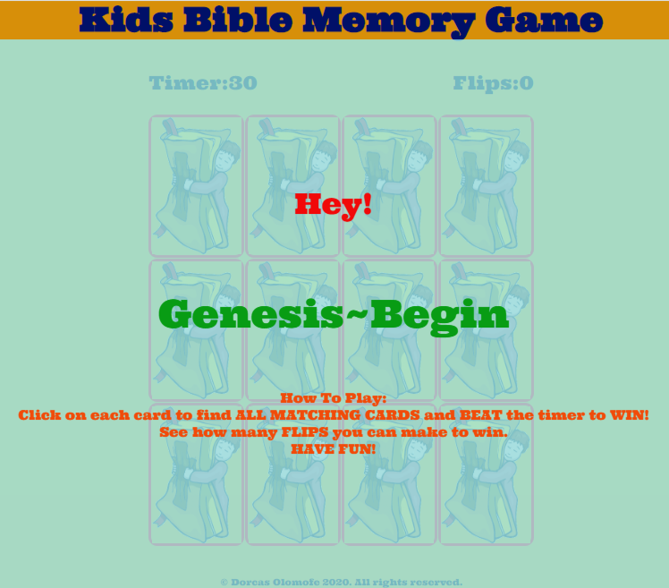

Welcome,

# Kids Bible Memory Game

## [Visit Site](https://dorcas-amoo.github.io/ms2-project-game/)

The idea of creating this game was birthed from the passion for teaching children Bible truths. Therefore, this project was undertaken to create a memory game for Christian kids. As a Sunday School teacher, I believe in "Catching Them Young"; (that phrase brings back to memory the title of a school play I acted in at age 9). I strongly believe if we teach children good morals and Bible truths, they will grow up to become great and exceptional leaders in the future. I also find that kids can get bored quite quickly and there is the need to keep them constantly entertained. Therefore, I decided to create a simple and easy to play memory game that will be suitable for kids between the ages of 2-10 years old.

As this is an interactive and fun memory game to play, this will help parents, teachers, uncles, aunties, baby-sitters, carers and many more, as I believe this can be used as one of the many fundamental ways of engaging children wherever they are; home, school, church etc so as to reduce boredom and at the same time keep them mentally active as the game will help in exercising their brain.

Thank you and enjoy the ride. :rocket:

## UX

This project is created to meet the needs of kids, parents, teachers, uncles, aunties, baby-sitters, carers and many more,. Below are a few _User Stories_.

* 'As a kid and a potential user who feels bored, on visiting your site, I want to be able to satisfy the desire to have some form of fun by playing a simple and easy to use game.'

* 'As a parent/carer, I need a game that will suit my Christian religious beliefs to help keep the kids engaged and entertained yet preserving our religious beliefs. I expect this game to be easy to understand so the kids can play independently'

* 'As a Sunday School teacher, I need a game to help keep the kids engaged at playtime in Sunday School.'

* 'As a developer, I want to meet the above needs by creating a memory game where kids in the Christian category can have some fun by flipping cards to find all matching cards at a set timeframe and see how quickly they can beat the timer to win.'

In order to meet the requirements of the users, I began to brainstorm on what to do and how to go about it and deliver the desired result. I then decided to create memory game so I searched and watched a few Youtube videos on how to. These helped me to have a clear understanding on how to construct the plan. I also looked at similar sites created by other code institute students which helped me to make an informed decision. Visiting other sites and watching tutorials really helped me to have a better idea and largely influenced my final decision and I am pleased with the outcome so far.  I also created the wireframe design of the website on Balsamiq [see file attached under UXdesigns folder](https://github.com/Dorcas-Amoo/ms2-project-game).

## Features

### Existing Features
1. **Overlay:** This was used to display messages such as:
  + The greeting ("Hey")
  + The play link ("Genesis~Begin")
  + The How To Play
  + The Game Over ("Revelation")
  + The Winner ("You're a Winner!")
  + Try Again
  + Restart
2. **The Timer:** This counts down when the game starts.
3. **The Flips Counter:** Counts and displays the number of times a player clicks on the cards.
4. **The Board Game:** This is the card game area.
5. **The Sound:** This includes the background music, flip sound, match sound when a player finds a match, game over sound and the winner sound depending on the actions taken by the player.
 
### Features to be Implemented

In order to expand the features of the game, I would like to implement the following in the future:

   i. Different levels to make the game more challenging.
   ii. A Score board for additional feedback.
   iii. Add different versions to make the game more educative and engaging.
   iv. A sound on/off feature.
   v. A login option with personalised greeting.

## Technologies Used
The following technologies were used to achieve the requirements of this project:

+ [Github](https://github.com/)
  + Github was used as the project repository and site host. 
+ [Gitpod](https://www.gitpod.io/) 
  + This was used to develop the site and [Git](https://git-scm.com/) for version control.
+ [CSS3](https://en.wikipedia.org/wiki/Cascading_Style_Sheets)
  + CSS3 was used to sytle my website to my desired outcome.
+ [HTML5](https://en.wikipedia.org/wiki/HTML5)
  + HTML5 was used as the markup language to structure and present my website on the Web.
+ [Javascript](https://www.javascript.com/)
  + I used this to achieve the interactive part of the game which helps the users have good fun on visiting the website.
  
  
 ## Testing
Over the course of building this project, I encountered a few challenging **bugs** which I was able to **fix** by asking relevant quetions and carrying out extensive research. This made it paramount for me to adopt the *defensive* approach and habitually carry out testings as I build the game (I made use of the **console.log** and viewed results in the **developer tool**) so as to ensure things work properly, and in addition to this, I carried out the following:

+ **Responsiveness Testing**
1. During construction, I regularly test the site against its *Responsiveness* by clicking on **Inspect** to view the *developer tool*.
2. I then checked the layout by clicking on the **Ipad, the Iphone and selected other devices to view**.
3. I also adjusted the pane to view the point at which the design changes to a mobile, tablet, laptop or desktop view.
4. This process helped me to adjust my media queries easily, in order to achieve my desired outcome.

+ **Page Testing**

I carried out the following tests on these devices (Mobile, tablet, laptop):

 + Once the page loads, all contents were displayed as expected.
 + I hovered and clicked on the **"Genesis~Begin"** to ensure the cursor changes to the hand and the **overlay** hides to start the game.
 + I noticed on click, the **background music** starts and the **timer** began counting down.
 + On clicking a card, card turns and the **flips** count started.
 + As card *flips*, the *flip sound plays*.
 + On clicking two *unmatched cards* both cards flips over.
 + I clicked on another card immediately but no flip occurred as expected.
 + On clicking two *matched cards*, the *matched sound plays*, the cards *stay unflipped* and another card could be successfully clicked.
 + On playing the game and as the *timer runs out*, the **"Revelation~Game Over" "Try Again"** overlay message popped up.
 + Once the game was over, the *background music stops* and the *game over sound plays*.
 + I hovered and clicked on the **"Try Again"** to ensure the cursor changes to the hand and the **overlay** hides to start the game.
 + I noticed on click, the **background music** starts and the **timer** began counting down.
 + Once all matching cards were found *within the timeframe*, all cards stay unflipped and the **"You're a Winner!" "Well Done!" "Replay"** message pops up.
 + Once the game was successfully completed, the *background music stops* and the *winner applause sound plays*.
 + I noticed the *timer* stops and displays remaining time, the *flips* also stops and displays the number of flips as expected.
 + I also noticed once the *"You're a Winner!" "Well Done!" "Replay"* message pops up, and all cards flip over as expected.
 + I hovered and clicked on the **"Replay"** to ensure the cursor changes to the hand and the **overlay** hides to start the game.
 + Again, the **background music** starts, *timer and flips* reset. and the **timer** began counting down.

+ **UX Testing**
  + To validate the user experience, I asked a family member and two kids to help. They were asked to use the site so as to help give an unbias and accurate feedback.
 
   1. They were to try using all the links, and play the game to test its functionality and usability.
 
   2. They all came back with different feedbacks as follows:
     + "I enjoyed the game."
     + "It was easy to use."
     + "It was fun."
     + "I think the background music was very nice."
     + "I think if there were sections of different games it will be more fun to play."
     + "My personal thoughts is that it is fun, I really enjoyed it but I wanted that still be different sections."
     + Overall, they were happy with the layout, colour scheme, responsiveness and easy access to the required information.
     + Viewing on different sizes and browsers were also positive as expected.They were able to navigate easily.
     + They commented that it was really easy to use and fun to play.
     + They commented that they had no difficulty and their user experiences were positive.

+ **HTML5 Testing**

1. For my **HTML5 code testing**, I visited [The W3C Markup Validation Service](https://validator.w3.org/)
2. I chose *Validate by Direct Input* option, copied and pasted my HTML codes in the available pane and clicked **Check*
3. I then got a message stating, "Document checking completed. No errors or warnings to show". (Please refer to [Testing folder in <>Code section](https://github.com/Dorcas-Amoo/ms2-project-game) for sample evidence).

+ **CSS3 and Browsers Testing**

1. For my **CSS3 code testing**, I visited [The W3C CSS Validation Service - Jigsaw](https://jigsaw.w3.org/css-validator/)
2. I chose *Validate by Direct Input* option, copied and pasted my CSS codes in the available pane and clicked **Check*
3. I got the message "Congratulations! No errors found" (Evidence attached in the [Testing folder in <>Code section](https://github.com/Dorcas-Amoo/ms2-project-game) above).
4. For browser testings, I did not have any issues opening or viewing the site on the different browsers that was used namely: **Microsoft Edge**, **Mozilla Firefox**, **Google Chrome**, **Safari** and other different mobile browsers, namely, **Android** and **iOS.** On all of these platforms, I had a smooth user-friendly experience.

+ **JavaScript Testing**

Given the scope of this project and the complexity and challenge of using the Jasmine automated testing, I adopted the manual and user testings as seen above to test the functionality of the JavaScript codes. 

## Deployment

To deploy my site, I made use of the GitHub hosting platform; GitHub Pages following this process:
1. I logged into [GitHub](https://github.com/).
2. Under repositories, from the list of projects, I clicked on **Dorcas-Amoo/ms2-project-game** then **Settings**.
3. Under **Settings**, I scrolled down to **GitHub Pages**.
4. From **GitHub Pages**, under **Source**, I clicked on the *dropdown arrow button* and selected **master branch** from the list.
5. Then on top of the **GitHub Pages** section, it states the following:
  + Your site is published at https://dorcas-amoo.github.io/ms2-project-game/
  
To run code **locally**:
1. From [GitHub](https://github.com/), click on the "Clone" button.
2. Choose "Download Zip" (The download starts).
3. After the download is complete, open the zip folder by double clicking to access created page.
4. The page will launch on your chosen browser.

## Credits & References
From my research, the following made an impact in the successful completion of this project as it had been challenging yet enjoyable. I have also learnt a lot from completing the project. Please kindly see links below. Thank you.

### Content
+ [The Font by Google Fonts' Ultra](https://fonts.google.com/specimen/Ultra?query=ultra)
+ [The Game Styling](https://css-tricks.com/)
+ [The Game content, structure & style](https://www.youtube.com/watch?v=28VfzEiJgy4&list=PLvaW2JKofl8_kI-vpd7lkSr-uY6fURbtq&index=17&t=0s)
+ [The Game functionality](https://www.youtube.com/watch?v=3uuQ3g92oPQ&list=PLvaW2JKofl8_kI-vpd7lkSr-uY6fURbtq&index=17)

+ **Tutorials**
  + [Code Institute for HTML, CSS, JavaScript & UX](https://courses.codeinstitute.net/program/FullstackWebDeveloper)
  + [Kyle-Web Dev Simplified for How to Code a Card Matching Game](https://www.youtube.com/watch?v=28VfzEiJgy4&list=PLvaW2JKofl8_kI-vpd7lkSr-uY6fURbtq&index=17&t=0s)
  + [PortEXE-How To Code A Card Game In Plain JavaScript-Spooky Halloween Edition](https://www.youtube.com/watch?v=3uuQ3g92oPQ&list=PLvaW2JKofl8_kI-vpd7lkSr-uY6fURbtq&index=17)
  + [freeCodeCamp.org-Memory Card Game - JavaScript Tutorial](https://www.youtube.com/watch?v=ZniVgo8U7ek&list=PLvaW2JKofl8_kI-vpd7lkSr-uY6fURbtq&index=10&t=0s) 
  + [Marina-Ferreira](https://marina-ferreira.github.io/projects/js/memory-game/)

+ **Others**
  + [Markdown-Cheatsheet](https://github.com/adam-p/markdown-here/wiki/Markdown-Cheatsheet#lines)
  + [Code Sketch](https://github.com/code-sketch/memory-game/)
  + [F1 Memory Game](https://filleben.github.io/F1MemoryGame/)

### Media
The card images used for the game, the sounds incorporated and for my *Wireframes* were from the following:
+ [Balsamiq](https://balsamiq.com/)
+ [SoundBible](http://soundbible.com/suggest.php?q=tick&x=0&y=0/)
+ [Vecteezy](https://www.vecteezy.com/vector-art/266136-jesus-lettering-5)
+ [Clipart Library](http://clipart-library.com/free/jesus-christ-transparent.html)

### Acknowledgements
I got inspiration for my project from the following:
+ [Code Institute](https://courses.codeinstitute.net/program/FullstackWebDeveloper)
+ [Marina Ferreira](https://marina-ferreira.github.io/)
+ [Web Dev Simplified](https://www.youtube.com/channel/UCFbNIlppjAuEX4znoulh0Cw)
+ [PortEXE](https://www.youtube.com/channel/UCjGQyJCSU_VVMTu5nigonqg)
+ [freeCodeCamp](https://www.freecodecamp.org/news/vanilla-javascript-tutorial-build-a-memory-game-in-30-minutes-e542c4447eae/)

Many thanks to my Mentor **Dick Vlaanderen** for his guidance despite the challenge of time difference. Also to my kid friends and family who helped to test the usability and functionality of the project and gave valuable feedbacks to assist in improving the site.

Thank you to the Code Institute Team!

--------

Thank you for visiting! :smile:
